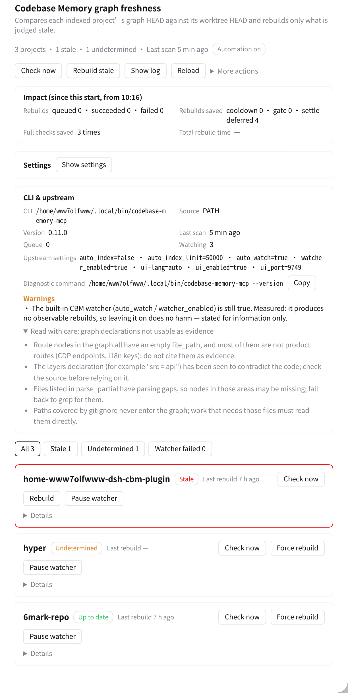
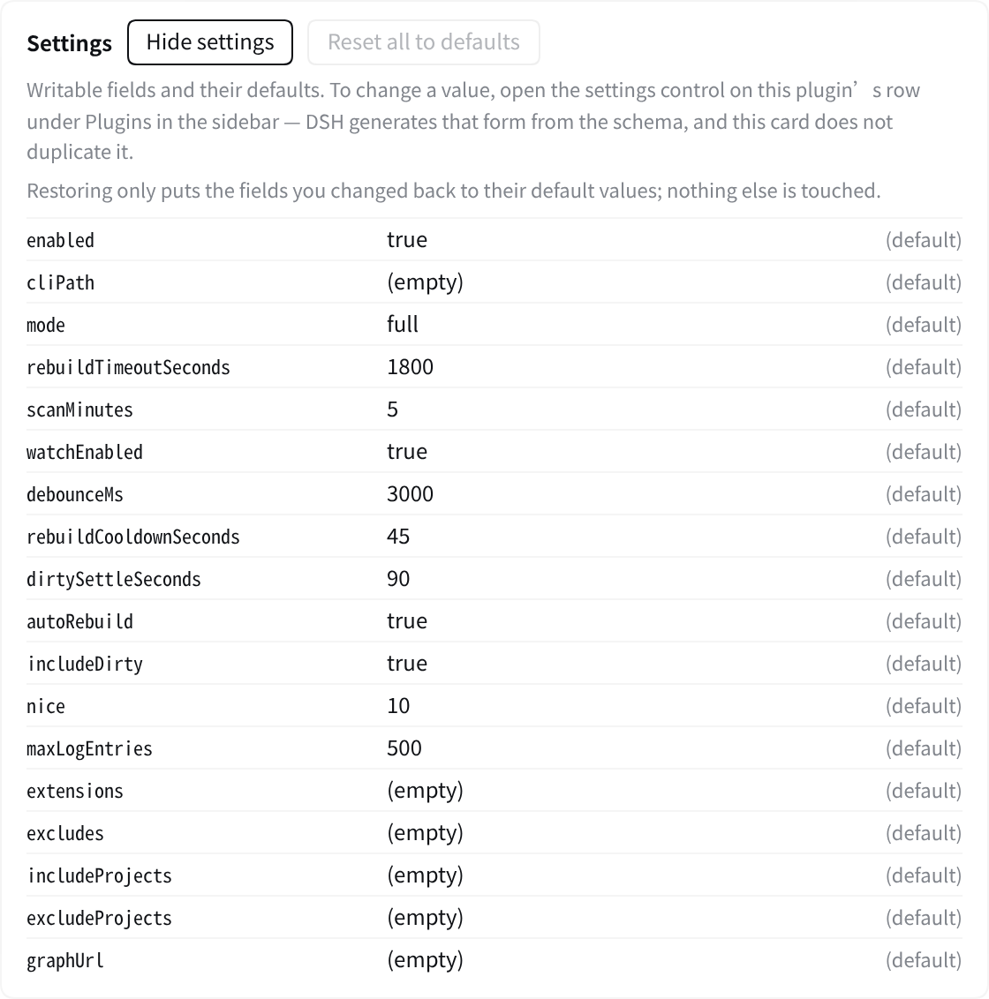

# dsh-codebase-watcher [](https://github.com/WwW7olFWwW/dsh-codebase-watcher/actions/workflows/ci.yml) [](LICENSE) [](https://github.com/WwW7olFWwW/dsh-codebase-watcher/releases)

English | [中文](README.md)

Wiring [Codebase Memory](https://github.com/DeusData/codebase-memory-mcp) (CBM) into [DeepSeek Harness](https://github.com/deepseek-ai/deepseek-harness) (DSH) with a single MCP row works fine for queries; what breaks is that the graph goes stale silently. The MCP `cwd` is a profile-level constant, so CBM's watching and auto-index land on the wrong tree. CBM's built-in watcher produces no observable rebuild, and the MCP tool `index_repository` has a 60-second cap. In one measured case the graph was 33 hours, 37 commits and 988 files behind while everyone believed it was current (raw data: P5 in [`docs/REQUIREMENTS.md`](docs/REQUIREMENTS.md)).

`dsh-codebase-watcher` measures how far the graph is behind, calls CBM's CLI to rebuild only when it has to, and shows the result on the settings card. Beyond installing the plugin there is nothing to change in CBM or DSH, and no systemd timer to set up.

## Requirements

- **Codebase Memory**: the `codebase-memory-mcp` CLI, tested on 0.11.0. Other versions still work and turn into a card warning. When the CLI is not on `PATH` the card shows "（未解析）" [unresolved]; set `cliPath` on the settings page.
- **Node.js ≥ 20.13** and **DSH ≥ 0.2.0-rc.2**, both declared in this plugin's `engines`. Recursive `fs.watch` on Linux only exists from Node 20.13.0 ([nodejs/node#45098](https://github.com/nodejs/node/pull/45098)); on 20.0–20.12 per-project watching fails outright, while scanning and conditional rebuilds keep working.
- **The project must be a git worktree**: staleness comes from comparing `git rev-parse HEAD` against the graph's `Branch.head_sha`.

## Installation

**This package is not on npm yet**, so the bare name `add dsh-codebase-watcher` returns 404. Use one of these full specs:

```sh
# 1. GitHub spec
dsh plugin --profile web add github:WwW7olFWwW/dsh-codebase-watcher

# 2. Release tarball (prebuilt: no build step, no build-script approval)
dsh plugin --profile web add https://github.com/WwW7olFWwW/dsh-codebase-watcher/releases/latest/download/dsh-codebase-watcher.tgz

# 3. Plugin market: search dsh-codebase-watcher
```

`--profile web` is the profile name on this machine — **substitute your own**: `dsh plugin --profile <your profile> add …`.

A "CBM 圖譜" [CBM Graph] card then appears under Settings; reload the page once if it does not.



### How to confirm it worked

```sh
curl -s http://127.0.0.1:3080/api/codebase-watcher/state
curl -s http://127.0.0.1:3080/api/codebase-watcher/config
```

- `state` returns something and `status.revision` is a number ⇒ the host half is alive and at least one scan has run.
- `runtime.rebuildCooldownMs` is visible in `config` ⇒ the new generation is loaded. **If that field is missing you are still on the old module cache**; restart `dsh web`.

### Turn off the upstream full rebuild

CBM's `auto_index` is an **unconditional** full rebuild: the graph may have just been updated and HEAD may not have moved, but opening a session runs it again anyway. Measured at 60,980 ms / 658 MB of database / 2,858 MB peak memory.

```sh
codebase-memory-mcp config set auto_index false
```

Leave it on and **every session burns about 61 seconds for nothing**, while duplicating this plugin's rebuilds. When the plugin starts and sees it still enabled, it leaves a named warning on the card.

## First run

The first scan adopts **every** project Codebase Memory has already indexed, and queues the stale ones for rebuild. Rebuilds run one at a time (global concurrency 1) at the cost above — three projects can mean three minutes of CPU and several GB of peak memory. Narrow the scope before you widen it:

- `includeProjects`: adopt only one or two named projects; start with one.
- `autoRebuild: false`: observe only, touch nothing, until you trust the verdicts.

Both are settings-page fields and take effect immediately.

## Features

- **Staleness detection**: the graph's `Branch.head_sha` against `git rev-parse HEAD`, giving an exact `behindBy`. With no `Branch` node it falls back to `indexed_at` and the database mtime; when the evidence is insufficient it reports "cannot be determined".
- **Conditional rebuild**: only stale projects are queued. When the graph already matches HEAD, `POST /rebuild` returns `queued: 0` and no indexing work happens.
- **Visible payoff**: the card carries a payoff block showing rebuilds queued / succeeded / failed **since this process started** (failures broken out by how many were aborted), how many rebuilds the cooldown and gate skipped, and cumulative rebuild time.
- **Sidebar indicator**: visible without opening Settings — a warn dot when projects are stale, an error dot when a rebuild or a watcher has failed; **nothing is rendered at all when everything is fresh** (quiet is the default). It is informational only, not clickable.

Rebuilds run as a child process, `codebase-memory-mcp cli index_repository`, which sidesteps the 60-second cap on the MCP tool. Every adopted project gets file watching with debounce, so a save is picked up on its own; without chokidar it falls back to `node:fs.watch`.

The settings card and the REST control plane share one source, so every card action can also be hit with curl. The card header and each project row link into the CBM graph UI (`?project=` deep-links to a single project); when the UI is off or unreachable the link says why instead of breaking.

## Measured

| Item | Result |
|---|---|
| Unit tests | `node --test test/*.test.js` → **204 tests / 204 pass / 0 fail** (the count only grows) |
| Host half against the real CBM CLI | `node tools/verify-keeper.mjs` → **23/23** |
| Client rendering (fed the real `/state`) | `node tools/verify-client.mjs` → **212/212** |

All three are re-runnable and need no index of their own (`verify-keeper` needs the CLI on `PATH`; `verify-client` needs `dsh web` running). The end-to-end item — the graph catching up after a commit, and how long the index itself takes — is in the verification table in [`docs/DEVELOPMENT.md`](docs/DEVELOPMENT.md).

### Rebuild chasing: A/B

The 45-second cooldown in 0.3.0 lowered the frequency of the rebuild storm without curing it — a project being actively edited still burned a full rebuild at a steady interval, every one of them aborted mid-flight, and the graph never caught up once. The same tool, two versions:

| | 0.3.0 | 0.4.0 (`dirtySettleSeconds: 90`) |
|---|---|---|
| Rebuilds during editing | 10 | 0 |
| Successful rebuilds | 0 | 1 |
| Aborted by `aborted_previous_preserved` | 10 | 0 |
| Graph caught up after you stop | no | yes |
| Injected probe calls | 214 | 66 (−69%) |
| — of which CBM CLI | 112 | 9 (−92%) |

`npm run bench` re-runs it with zero external dependencies; CI runs the same command with `--assert`, so this behaviour coming back turns the build red.

**This is a proportional model, not wall-clock seconds.** The real `CbmKeeper`, the real `node:fs.watch` and real timers are used, but the git probe, the CBM CLI and the rebuild itself are injected stand-ins — **a call count equals the number of real child processes**. Time is compressed by about 1/30 (ratios preserved, so it extrapolates), which means the catch-up seconds have to be scaled back up to get real time.

## Why not an existing option

- **A sibling plugin**: `dsh-codebase-memory` has gone 39 days without an update, its Linux path resolution always fails with no setting to override it, and its bundle id collides.
- **CBM's built-in `auto_index`**: an unconditional full rebuild that burns 61 seconds at every session start; switch it off and you get no automatic updates at all. This plugin rebuilds only what is stale.
- **Anything outside the host**: a systemd timer means touching the host; one profile per project means copying every other setting N times; starting DSH from the project directory is impossible because DSH runs under systemd with a fixed `WorkingDirectory`.

The full comparison is in section 7 of [`docs/REQUIREMENTS.md`](docs/REQUIREMENTS.md).

## Compatibility

| Plugin | DSH | Codebase Memory |
|---|---|---|
| `0.3.x` | `>=0.2.0-rc.2` (tested on 0.2.0-rc.2; declared via `engines.dsh`) | `codebase-memory-mcp@0.11.0` (versions outside the list turn into a card warning) |

## Configuration

18 tunable fields and 7 REST routes: [`docs/CONFIGURATION.md`](docs/CONFIGURATION.md). Field changes take effect immediately, no restart, and defaults are one click away (only the fields you changed are cleared).



State lives in `~/.dsh/codebase-watcher/state.json` and the log in `~/.dsh/codebase-watcher/keeper.log`. Read-only query: `curl -s http://127.0.0.1:3080/api/codebase-watcher/state`.

## Known limitations

chokidar is an optional dependency; without it the watcher falls back to `node:fs.watch`. Projects rooted at the home directory are not watched by CBM (upstream security policy). The graph's structural claims cannot be used as evidence.
Everything else is in [`docs/LIMITATIONS.md`](docs/LIMITATIONS.md).

## Removal

```sh
dsh plugin --profile web remove dsh-codebase-watcher
rm -rf ~/.dsh/codebase-watcher
rm -f ~/.dsh/profiles/web/node_modules/dsh-codebase-watcher
```

Substitute your own profile name in the first line too. The last line clears a known pnpm leftover for `link:` packages: the symlink stays in `node_modules` after the dependency is gone. Uninstalling does not delete the state directory; remove it yourself.

## Development

```sh
node --test test/*.test.js   # 204 unit tests, no real index needed
```

[Architecture](docs/ARCHITECTURE.md) ｜ [Verification status](docs/DEVELOPMENT.md) ｜ [Requirements](docs/REQUIREMENTS.md) ｜ [Publishing](docs/PUBLISHING.md) ｜ [Contributing](CONTRIBUTING.md) ｜ [Changelog](CHANGELOG.md) ｜ [Issues](https://github.com/WwW7olFWwW/dsh-codebase-watcher/issues)

## License

[MIT](LICENSE) © 2026 [WwW7olFWwW](https://github.com/WwW7olFWwW)
