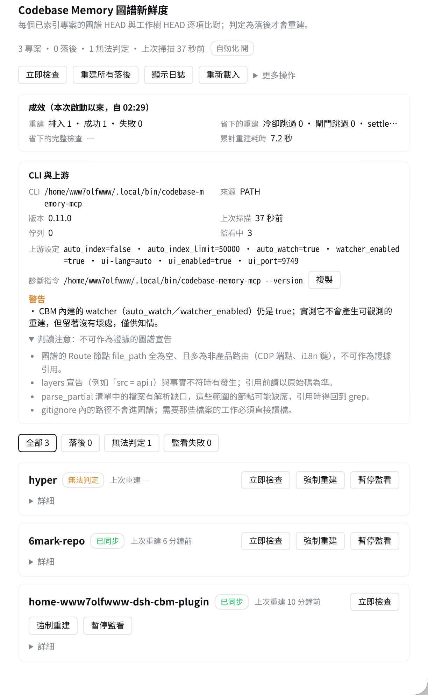

# dsh-codebase-watcher [](https://github.com/WwW7olFWwW/dsh-codebase-watcher/actions/workflows/ci.yml) [](LICENSE) [](https://github.com/WwW7olFWwW/dsh-codebase-watcher/releases)

[English](README.en.md) | 中文

用一行 MCP row 把 [Codebase Memory](https://github.com/DeusData/codebase-memory-mcp)（CBM）接進 [DeepSeek Harness](https://github.com/deepseek-ai/deepseek-harness)（DSH），查詢本身沒問題，問題出在圖譜會靜默過期。MCP 的 `cwd` 是 profile 級常數，CBM 的監看與 auto-index 因此落在錯的樹；CBM 內建的 watcher 不產生可觀測的重建；MCP 工具 `index_repository` 還有 60 秒上限。實測圖譜曾落後 33 小時、37 個提交、988 個檔案，而所有人都以為它是新的（原始數據：[`docs/REQUIREMENTS.md`](docs/REQUIREMENTS.md) 的 P5）。

`dsh-codebase-watcher` 自己判斷圖譜落後多少，只在需要時呼叫 CBM 的 CLI 重建，並把結果擺在設定頁看得見的地方。除了裝這個插件，不必改 CBM 或 DSH 的設定，也不用另外掛 systemd timer。

## 需求

- **Codebase Memory**：需要 `codebase-memory-mcp` 這支 CLI，實測 0.11.0；清單外的版本可以用，卡片上會轉為警告。它不在 `PATH` 時卡片顯示「（未解析）」，在設定頁填 `cliPath` 即可。
- **Node.js ≥ 20.13**，DSH ≥ 0.2.0-rc.2；兩者都由本插件的 `engines` 宣告。Linux 的遞迴 `fs.watch` 自 Node 20.13.0 才有（[nodejs/node#45098](https://github.com/nodejs/node/pull/45098)），20.0–20.12 會讓每專案監看直接失敗——掃描與條件式重建不受影響。
- **專案必須是 git 工作樹**：落後判定靠 `git rev-parse HEAD` 與圖譜的 `Branch.head_sha` 對比。

## 安裝

**npm 上還沒有這個套件**，所以 `add dsh-codebase-watcher` 這個裸名會 404。用下面任一條完整規格：

```sh
# 1. GitHub 規格
dsh plugin --profile web add github:WwW7olFWwW/dsh-codebase-watcher

# 2. Release tarball（預先打包，免建置、免授權建置腳本）
dsh plugin --profile web add https://github.com/WwW7olFWwW/dsh-codebase-watcher/releases/latest/download/dsh-codebase-watcher.tgz

# 3. 插件市場：搜 dsh-codebase-watcher
```

`--profile web` 是這台機器上的 profile 名字，**換成你自己的**：`dsh plugin --profile <你的 profile> add …`。

設定頁接著會多一張「CBM 圖譜」卡片；沒看到就重整一次頁面。



### 怎麼確認裝成功

```sh
curl -s http://127.0.0.1:3080/api/codebase-watcher/state
curl -s http://127.0.0.1:3080/api/codebase-watcher/config
```

- `state` 回得出東西，而且 `status.revision` 是數字 ⇒ host 半邊活著，掃描跑過至少一輪。
- `config` 的 `runtime` 裡看得到 `rebuildCooldownMs` ⇒ 新世代已經載入。**看不到這個欄位就是還在跑舊的模組快取**，重啟 `dsh web` 即可。

### 順手關掉上游的全量重建

CBM 的 `auto_index` 是**無條件**的全量重建：圖譜剛更新過、HEAD 也沒動，開一個 session 它照樣重跑一次。實測一次 60,980 ms／資料庫 658 MB／峰值記憶體 2.8 GB。

```sh
codebase-memory-mcp config set auto_index false
```

不改的後果是**每個 session 白燒一次約 61 秒**，而且會和本插件的重建互相重複。插件啟動時偵測到它還開著，會在卡片上留一筆具名警告。

## 首次啟動

第一次掃描會納管 CBM 已經索引的**全部**專案，其中落後的會排進重建。重建全域併發 1，單次成本如上——三個專案就可能是三分鐘的 CPU 與數 GB 的峰值記憶體。先縮小範圍再放大：

- `includeProjects`：只納管指定的一兩個專案，先拿一個試。
- `autoRebuild: false`：只觀察、不動手，確認判定正確再說。

兩個都在設定頁改，改完立刻生效。

## 功能

- **落後判定**：圖譜的 `Branch.head_sha` 對上 `git rev-parse HEAD`，給出精確的 `behindBy`；沒有 `Branch` 節點時退用 `indexed_at` 與資料庫 mtime，證據不足就回報「無法判定」。
- **條件式重建**：只排入落後的專案；圖譜已經對上 HEAD 時，`POST /rebuild` 回 `queued: 0`，不產生任何索引工作。
- **成效看得見**：卡片有一塊「成效」，顯示**本次啟動以來**的重建排入／成功／失敗（失敗另標其中幾次是被中止）、冷卻與閘門省下的重建次數、以及累計重建耗時。

重建是以子行程呼叫 `codebase-memory-mcp cli index_repository`，繞過 MCP 工具那個 60 秒上限。每個已納管的專案都有檔案監看與防抖，存檔後自動追上；chokidar 不在時退回 `node:fs.watch`。

設定頁的卡片與 REST 控制面同源，卡片上的每個動作都能用 curl 打。卡片標題列與每個專案列各有一顆連到 CBM 圖譜 UI 的連結（`?project=` 直達單一專案）；UI 沒開或連不上時標明原因，不給點了會壞的按鈕。

## 實測

| 項目 | 結果 |
|---|---|
| 單元測試 | `node --test test/*.test.js` → **198 tests / 198 pass / 0 fail**（數字只增不減） |
| Host 半邊對真實 CBM CLI | `node tools/verify-keeper.mjs` → **23/23** |
| 客戶端渲染（餵真實 `/state`） | `node tools/verify-client.mjs` → **212/212** |

這三條都能自己重跑，不需要先索引任何東西（`verify-keeper` 需要 CLI 在 `PATH`，`verify-client` 需要 `dsh web` 在跑）。端到端那條——提交後圖譜追上、索引本身耗時——記在 [`docs/DEVELOPMENT.md`](docs/DEVELOPMENT.md) 的驗證現況表。

### 重建追逐：A/B 對照

0.3.0 的「45 秒冷卻」只把重建風暴壓低頻率，沒有治好它——一個正在被編輯的專案仍然每隔一段時間燒掉一次完整重建，而每一次都在途中被中止，圖譜從頭到尾沒有追上。同一支工具在兩版上的輸出：

| | 0.3.0 | 0.4.0（`dirtySettleSeconds: 90`） |
|---|---|---|
| 編輯期間的重建 | 10 次 | 0 次 |
| 重建成功 | 0 次 | 1 次 |
| 被 `aborted_previous_preserved` 中止 | 10 次 | 0 次 |
| 停手後追上圖譜 | 沒有追上 | 追上 |
| 注入探針呼叫 | 214 | 66（−69%） |
| 　其中 CBM CLI | 112 | 9（−92%） |

`npm run bench` 可重跑，零外部相依；CI 跑同一條指令並帶 `--assert`，所以這種行為回來會直接紅燈。

**這是比例模型，不是實機秒數。** 真的 `CbmKeeper`、真的 `node:fs.watch`、真的計時器，但 git 探針／CBM CLI／重建本身是注入替身——**呼叫次數就等於真實的子行程次數**。時間參數等比壓縮約 1/30（比例不變，可以外推），所以「追上」的秒數要乘回去才是真實時間。

## 為什麼不直接用現成的

- **同類插件**：`dsh-codebase-memory` 已經 39 天沒有更新，Linux 路徑解析必然失敗又沒有設定可以覆寫，bundle id 還會撞名。
- **CBM 內建的 `auto_index`**：無條件全量重建，每個 session 白燒 61 秒；關掉它則完全沒有自動更新。本插件是「只在落後時重建」。
- **宿主外部方案**：systemd timer 要動宿主；一專案一 profile 要把其餘設定複製 N 份；從專案目錄啟動 DSH 不可能——DSH 由 systemd 常駐，`WorkingDirectory` 固定。

完整對照表在 [`docs/REQUIREMENTS.md`](docs/REQUIREMENTS.md) 第 7 節。

## 相容版本

| 插件 | DSH | Codebase Memory |
|---|---|---|
| `0.3.x` | `>=0.2.0-rc.2`（實測 0.2.0-rc.2；由 `engines.dsh` 宣告） | `codebase-memory-mcp@0.11.0`（清單外版本在卡片上轉為警告） |

## 設定

18 個可調欄位與 7 條 REST 路由：[`docs/CONFIGURATION.md`](docs/CONFIGURATION.md)。欄位改完立刻生效，不用重啟。

狀態檔在 `~/.dsh/codebase-watcher/state.json`，日誌在 `~/.dsh/codebase-watcher/keeper.log`；唯讀查詢：`curl -s http://127.0.0.1:3080/api/codebase-watcher/state`。

## 已知限制

chokidar 是選用相依，缺席時退回 `node:fs.watch`。以家目錄為根的專案不支援 CBM 監看（上游安全政策）。圖譜的結構宣告不可作為證據。
其餘見 [`docs/LIMITATIONS.md`](docs/LIMITATIONS.md)。

## 移除

```sh
dsh plugin --profile web remove dsh-codebase-watcher
rm -rf ~/.dsh/codebase-watcher
rm -f ~/.dsh/profiles/web/node_modules/dsh-codebase-watcher
```

第一行的 profile 名字同樣要換成你自己的；最後一行清的是 pnpm 對 `link:` 套件的已知殘留：相依移除了，`node_modules` 裡的符號連結還在。卸載不會刪狀態目錄，要你自己刪。

## 開發

```sh
node --test test/*.test.js   # 198 項單元測試，不需要真的索引
```

[架構](docs/ARCHITECTURE.md)｜[驗證現況](docs/DEVELOPMENT.md)｜[需求規格](docs/REQUIREMENTS.md)｜[發布清單](docs/PUBLISHING.md)｜[貢獻指南](CONTRIBUTING.md)｜[變更記錄](CHANGELOG.md)｜[問題回報](https://github.com/WwW7olFWwW/dsh-codebase-watcher/issues)

## 授權

[MIT](LICENSE) © 2026 [WwW7olFWwW](https://github.com/WwW7olFWwW)
